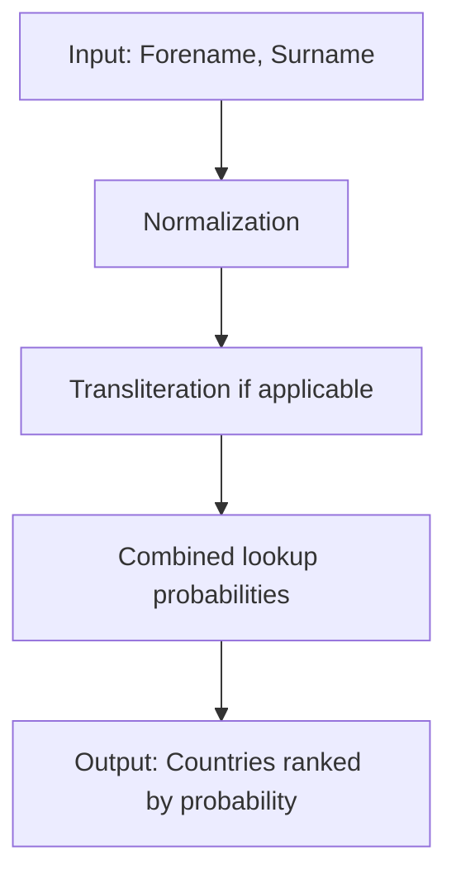

# Likelihood of Names and Surnames from Countries

This project is a **minimum viable product (MVP)** for an application that takes a **forename and surname** as input and assigns a **probability distribution over countries** where the name is likely to originate.  

For example, given the input: "Aleksandra Plochocka"


The algorithm might assign probabilities like:

| Country | Probability |
|---------|------------|
| Poland  | 0.85       |
| Germany | 0.10       |
| USA     | 0.05       |

---

## Data

The current implementation uses the following datasets:  

- **[Popular Names by Country (GitHub)](https://github.com/sigpwned/popular-names-by-country-dataset)** – lists popular forenames and surnames per country.  
- **[names-dataset (PyPI)](https://pypi.org/project/names-dataset/)** – a large first and last name dataset with country distributions.  
- **[Hobson/surname-nationality (HuggingFace)](https://huggingface.co/datasets/Hobson/surname-nationality)** – provides surnames with nationality mappings.  

### Future Data Enhancements

- Scrape popular baby names from official national statistics sites for **more coverage across countries**.  
- Leverage **Wikipedia and other open sources** to expand coverage of forenames and surnames globally.  
- Maintain **normalized country codes** (ISO2/ISO3) for consistency.

---

## Algorithm



    
The core algorithm estimates the likelihood of a name belonging to a particular country by combining **forename and surname distributions** across datasets.  

High-level steps:  

1. **Normalize inputs**: lowercase, remove accents, strip spaces/hyphens.  
2. **Handle transliteration variants**: if applicable map common variations of names from non-Latin scripts.  
3. **Lookup probabilities**: retrieve probability distributions from datasets.  
4. **Combine forename and surname probabilities**: using a weighted or multiplicative model.  
5. **Return ranked list of countries** with probabilities.  

---

### Handling Multiple Possible Countries

Many names are **common in multiple countries**, often due to historical, linguistic, or colonial overlap.  

Example:  

| Name  | Possible Countries            |
|-------|-------------------------------|
| Silva | Portugal, Brazil, Mozambique  |
| Lee   | China, Korea, USA             |

The algorithm distributes probability accordingly, reflecting **real-world ambiguity**.

---

### Spelling Mistakes and Transliteration

Names can appear in **different spellings** due to typos or transliteration from other scripts:  

- **Cyrillic**: Михаил → Mikhail, Mihail  
- **Arabic**: محمد → Muhammad, Mohamed, Mohamad  
- **Persian/Other**: Mohammad, Muhamed  

The algorithm uses **variant mapping and probabilities** to consolidate these variations to likely countries.  

---

### Multicultural Names

Some names are **inherently multicultural** due to migration, mixed heritage, or international usage.  

Example:  

| Name            | Possible Countries          |
|-----------------|----------------------------|
| Sofia           | Italy, Spain, Bulgaria     |
| Aleksandra      | Poland, Russia, Ukraine    |

The model can output **multiple plausible countries with probabilities**, rather than forcing a single match.

---

## Evaluation

### Testing

- Dataset is split into **train/test** for validation.  
- Accuracy is measured by how often the **top predicted country matches the true country**.  
- Probabilistic metrics like **cross-entropy loss** or **top-k accuracy** can also be applied.  

### Results

Example output on the test set:

| Input Name         | Top Prediction | True Country | Probability |
|-------------------|----------------|--------------|------------|
| Aleksandra Plochocka | Poland         | Poland       | 0.85       |
| John Smith          | USA            | UK           | 0.60       |
| Chen Wei            | China          | China        | 0.90       |

> Preliminary results show strong alignment for **distinctive names**; ambiguous or multicultural names are distributed over multiple countries.

---

## Usage

You can use this project to **predict the likelihood of a forename and surname belonging to certain countries**.  

### 1️⃣ Install Dependencies

```
pip install pandas names-dataset datasets
```


### 2️⃣ Load the Model / Data
```
import pandas as pd
from names_dataset import NameDataset
from datasets import load_dataset
```
# Example: load HuggingFace surname-nationality dataset
hf_dataset = load_dataset("Hobson/surname-nationality", split="train")
df_surnames = hf_dataset.to_pandas()

# Initialize the names-dataset library
nd = NameDataset()

### 3️⃣ Predict Country Probabilities

```
def predict_name_country(first_name, last_name):
    # Normalize input
    first_name = first_name.strip().title()
    last_name  = last_name.strip().title()
    
    results = {}
    
    # Forename probabilities from names-dataset
    fn_info = nd.search(first_name).get("first_name", {})
    fn_countries = fn_info.get("country", {})
    
    # Surname probabilities from HuggingFace dataset
    sn_rows = df_surnames[df_surnames['surname'] == last_name]
    sn_countries = {}
    if not sn_rows.empty:
        sn_countries = {row['nationality']: 1.0 for _, row in sn_rows.iterrows()}  # Example
    
    # Combine probabilities (simple additive approach)
    for country in set(list(fn_countries.keys()) + list(sn_countries.keys())):
        fn_prob = fn_countries.get(country, 0)
        sn_prob = sn_countries.get(country, 0)
        results[country] = (fn_prob + sn_prob) / 2  # simple average
    
    # Sort results
    results = dict(sorted(results.items(), key=lambda x: x[1], reverse=True))
    
    return results
```

# Example usage
name_probs = predict_name_country("Aleksandra", "Plochocka")
print(name_probs)
Expected Output (example):
{'Poland': 0.85, 'Germany': 0.10, 'USA': 0.05}

### 4️⃣ Notes
The algorithm currently outputs probabilities for multiple countries, especially for multicultural or ambiguous names.
Transliterated names (from Cyrillic, Arabic, etc.) may need preprocessing or variant mapping for better accuracy.
This is an MVP; probability calculation can be refined using weighted datasets or machine learning models.

