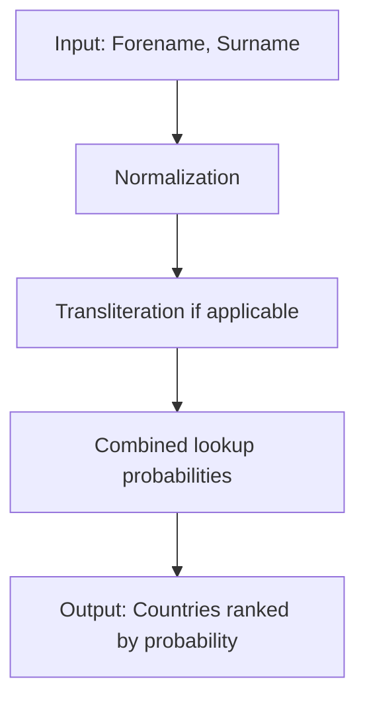

# Likelihood of Names and Surnames from Countries

This project is a minimum viable product (MVP) for an application that takes a forename and surname as input and assigns a probability distribution over countries where the name is likely to originate.  

For example, given the input: "John Smith"


The algorithm might assign probabilities like:

| Country | Probability |
|---------|------------|
| UK  | 0.85       |
| USA | 0.10       |
| Australia     | 0.05   |

---

## Data

The current implementation uses the following datasets to create a synthetic set of forenames, surnames and countries:  

- [Popular Names by Country (GitHub)](https://github.com/sigpwned/popular-names-by-country-dataset) – lists popular forenames and surnames per country.  
- [names-dataset (PyPI)](https://pypi.org/project/names-dataset/) – a large first and last name dataset with country distributions.  
 

### Future Data Enhancements

- Scrape popular baby names from official national statistics sites for more coverage across countries.
- [Hobson/surname-nationality (HuggingFace)](https://huggingface.co/datasets/Hobson/surname-nationality) – provides surnames with nationality mappings. 
- Leverage Wikipedia and other open sources to expand coverage of forenames and surnames globally.  

---

## Algorithm



    
The core algorithm estimates the likelihood of a name belonging to a particular country by combining forename and surname distributions across datasets.  

High-level steps:  

1. **Normalize inputs**: lowercase, remove accents, strip spaces/hyphens.  
2. **Handle transliteration variants**: if applicable map common variations of names from non-Latin scripts.  
3. **Lookup probabilities**: retrieve probable list of countries from joint lookup tables.
4. **Return ranked list of countries** with probabilities using an LLM in combination with the lookup table.  

---

### Handling Multiple Possible Countries

Many names are common in multiple countries, often due to historical, linguistic, or colonial overlap.  

Example:  

| Name  | Possible Countries            |
|-------|-------------------------------|
| Silva | Portugal, Brazil, Mozambique  |
| Lee   | China, Korea, USA             |

The algorithm distributes probability accordingly, reflecting real-world ambiguity.

---

### Spelling Mistakes and Transliteration

Names can appear in different spellings due to typos or transliteration from other scripts:  

- **Cyrillic**: Михаил → Mikhail, Mihail  
- **Arabic**: محمد → Muhammad, Mohamed, Mohamad  

The algorithm uses simple transliteration to switch names to roman characters.

---

### Multicultural Names

Some names are inherently multicultural due to migration, mixed heritage, or international usage.  

Example:  

| Name            | Possible Countries          |
|-----------------|----------------------------|
| Sofia           | Italy, Spain, Bulgaria     |
| Aleksandra      | Poland, Russia, Ukraine    |

The model can output multiple plausible countries with probabilities, rather than forcing a single match.

---

## Evaluation

### Testing

- Dataset is split into **train/test** for validation.  
- Accuracy is measured by how often the top predicted country matches the true country.  
- Probabilistic metrics like cross-entropy loss or top-k accuracy can also be applied.  

### Results

Example output on the test set:

| Input Name         | Top Prediction  | Probability |
|-------------------|----------------|------------|
| Kim Lee | Republic of Korea  | 0.60     |
| Александр Иванов          | Russian Federation           |  0.60       |
| Ελένη Αθανασίου            | Greece          |  0.85       |

> Preliminary results show strong alignment for **distinctive names**; ambiguous or multicultural names are distributed over multiple countries.

---

## Usage

You can use this project to **predict the likelihood of a forename and surname belonging to certain countries**.  

### 1️⃣ Install Dependencies

```
uv sync
```


### 2️⃣ Load the Model / Data
```
uv run python main.py
```
# Example: change the names in the main.py script (lines 259-260)

### 3️⃣ Evaluation script
Use, 
```
uv run python evaluate_method.py --test-size 0.2
```
to evaluate how well the model predicts countries for given first and last names (this is set to the standard 80/20 train/test split).

### 4️⃣ Notes
The algorithm currently outputs probabilities for multiple countries, especially for multicultural or ambiguous names.
Transliterated names (from Cyrillic, Arabic, etc.) may need preprocessing or variant mapping for better accuracy.
This is an MVP; probability calculation can be refined using weighted datasets or machine learning models.

